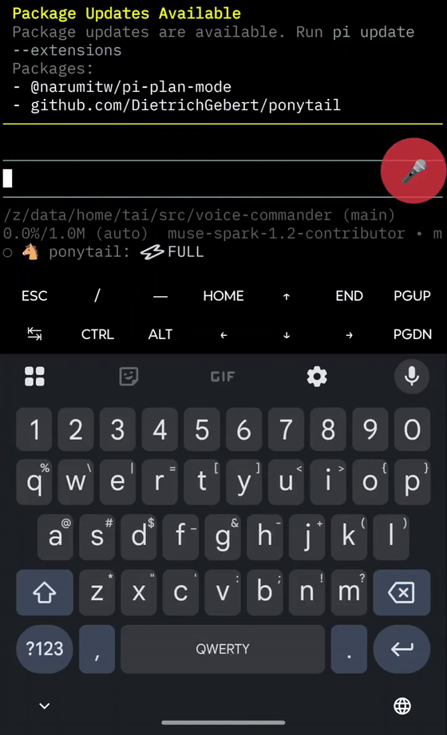

# VoiceCommander




Speak a task, and the instruction the agent actually needs — not your literal
words — lands at the agent's prompt in your terminal, on Android.

Hold a button on a floating panel, say what you want done, release, and a
review popup shows what the agent will receive — the interpretation when it's
ready, your raw words when it isn't — with **Send**, **Edit**, or **Cancel**.
Send delivers the text into the app in front of you — Termux first, other apps
generically, clipboard as a universal fallback. Nothing is
executed by voice alone: the instruction is text at the agent's prompt, and the
agent acts only after you press Return in the terminal.

```
┌────────────────────────────────────────────────┐
│ RAW (streaming while you hold)                 │
│ uh, find the unsafe in the Rust files in this  │
│ directory and, um, make a list of them…        │
│                                                │
│ INTENT (appears ~1-2s after release)           │
│ List every use of `unsafe` in Rust files under │
│ this directory.                                │
│                                                │
│              → Termux                          │
└────────────────────────────────────────────────┘
        │  release the button
        ▼
┌────────────────────────────────────────────────┐
│ INTENT  List every use of `unsafe` in Rust     │
│         files under this directory.            │
│                                                │
│   [Send]     [Edit]     [Cancel]    → Termux   │
└────────────────────────────────────────────────┘
```


## Why it is worth using

- **It sends what you meant, not what you said.** Dictation types fillers,
  false starts and backtracking verbatim. VoiceCommander turns the spoken
  sentence into the instruction that expresses it: say "reschedule it to
  3 pm — no wait, 4 pm" and the agent is told 4 pm.
- **You see it, then you decide.** Nothing is sent on release alone: the
  review popup shows the exact text — interpreted when ready, raw when not —
  and gives you Send, Edit, or Cancel. A misfire costs one tap, never an
  action.
- **Nothing runs on voice alone.** The instruction lands as *text* at the
  agent's prompt in Termux. The agent is not invoked until you press Return in
  the terminal.
- **Cheap to use daily.** The raw speech comes from Android's built-in speech
  recognition (on-device, free); the interpretation is the only paid step.
- **Technical speech works.** Terms, paths, identifiers, flags and mixed
  Japanese/English/code survive; set your vocabulary in settings (transcription
  keywords).
- **Other apps too.** If an app's text field can receive it, VoiceCommander
  writes into it directly; otherwise the text goes to the clipboard with a
  clear notice. The same panel drives all three routes.

## The flow

```
hold floating button ── speak ── release
        │                     │ slide finger off = cancel silently
        ▼
RAW (live transcript, streams while you hold)
        │  debounced snapshot
        ▼
INTENT (LLM interpretation, live in the panel; the popup never waits for it)
        │
        ▼  review popup: Send / Edit / Cancel
        │
Send ──► tmux send-keys into Termux │ ACTION_SET_TEXT into a text field │ clipboard
        │
        ▼  you press Return in the terminal
agent runs it
```

RAW and INTENT show on a floating panel that works in any app. The
interpretation runs on the OpenAI API; speech recognition is on-device.

## What you need

- Android 10 (API 29) or newer. A phone you can live with wearing a persistent
  notification.
- **Termux** (from F-Droid) with an interactive agent CLI, plus the **Termux:API**
  app (`com.termux.api`) — that is what lets VoiceCommander write into a
  terminal session. (If you later turn on OpenAI realtime transcription, an
  OpenAI API key is required for that too.)
- Google Play Services speech recognition for the default RAW path. The
  OpenAI realtime provider is the fallback for devices without it.
- Granted permissions, once: microphone, display-over-other-apps, accessibility
  (for delivery into other apps and the optional volume-key trigger), battery
  optimisation exemption. The app walks you through each one on first launch.

## Install

```bash
git clone <this repo> && cd voice-commander
./gradlew :app:assembleDebug                       # or use Android Studio
adb install -r app/build/outputs/apk/debug/app-debug.apk
```

Or open the project in Android Studio and press Run. There is no packaged
release yet.

First launch: follow the permission walkthrough (mic → display over other
apps → accessibility → battery). In **Termux**, install `termux-api` and run
`pkg install termux-api`, then in VoiceCommander settings confirm Termux routes
through `termux-input`. If you use the volume-key trigger, set your volume keys
accordingly when VoiceCommander asks.

## Using it

**Speak a task:** hold the floating **●** button, say what you want done,
release. The review popup appears.

- **Send** — delivers the INTENT to the target (Termux, the focused text
  field, or the clipboard) and closes.
- **Edit** — opens a small editing screen with the current text; return closes
  it and brings back the review popup. The editor has its own **Send** so the
  edit → send path is one tap.
- **Cancel** — discards everything.
- **Slide off the button while speaking** — cancels silently, no popup.
- Release before INTENT is ready: the popup opens instantly with the **raw
  text**, ready to send — release the moment RAW reads well. If the
  interpretation finishes while the popup is open, the preview updates before
  you tap. Only tapping **Send** delivers anything; your raw words are sent
  only when you explicitly send them, never automatically.

**Spoken directives** work mid-sentence: *make it shorter*, *in English*,
*type it verbatim*. The INTENT reflects them before the popup appears.

**Confirm in the terminal:** after Send into Termux, the instruction is text at
the agent's prompt. Press **Return in Termux** to hand it to the agent.
VoiceCommander never presses Return for you.

**Volume-key trigger (optional):** hold **Volume Up** to speak, release to open
the same review popup. Turn it on in settings; volume control returns when it's
off.

**Target choice:** the popup footer names the destination ("→ Termux").
VoiceCommander picks it automatically: frontmost app is Termux → the tmux
session;
frontmost is another app with a focused text field → direct insert; otherwise
→ clipboard ("copied — paste where you want").

**The notification** keeps the input service alive (required by Android) and
holds the same Start / Stop controls.

## If something goes wrong

| What you see | What to do |
| --- | --- |
| Button does nothing | Check the notification is present (the service is running); start it from the notification if not. Check mic permission. |
| Popup says "no target" | Termux wasn't frontmost (and no text field was focused). Focus Termux first, or tap Send anyway to get clipboard fallback. |
| INTENT never appears | The popup still shows the raw text; a ↻ retry re-runs interpretation, Edit lets you take over the text yourself. |
| Terms come out wrong (Rust, unsafe…) | Add them under Transcription keywords in settings. |
| Volume keys don't switch to listening | The volume-key trigger needs accessibility + the per-device quirks named in `AGENTS.md`; the button always works. |
| Wrong instruction | Cancel and re-speak, or use Edit. |
| Two panels | Only one service instance runs; kill and restart the app if a stale one lingers. |

## For developers

This README is for using the app. If you are changing it:

- `AGENTS.md` — how the project is laid out and worked on, plus the hard rules.
- `DESIGN.md` — how it is designed, the decisions awaiting review, and what
  differs from intent.
- `STATUS.md` — what is done, what is measured, what is outstanding.